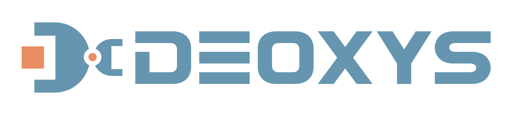

<p align="center">

</p>

<p align="center">
<a href="https://github.com/UT-Austin-RPL/deoxys_control/actions">

</a>
<a href="https://github.com/UT-Austin-RPL/deoxys_control/graphs/contributors">

</a>
<a href="https://github.com/UT-Austin-RPL/deoxys_control/issues">

</a>


[**[Documentation]**](https://zhuyifengzju.github.io/deoxys_docs/html/index.html) &ensp; 

Deoxys is a modular, real-time controller library for Franka Emika Panda arm, aiming to facilitate a wide range of robot learning research. Deoxys comes with a user-friendly python interface and real-time controller implementation in C++. If you are a [robosuite](https://github.com/ARISE-Initiative/robosuite) user, Deoxys APIs provide seamless transfer 
from you simulation codebase to real robot experiments!


https://user-images.githubusercontent.com/21077484/206338997-8dbaa128-dc63-4911-84ca-64d80a05673f.mp4


## Modifications

> **Note:** This is a modified fork of the original [UT-Austin-RPL/deoxys_control](https://github.com/UT-Austin-RPL/deoxys_control) repository. This fork includes improvements to the build system (CMake) and enhancements to both client-side (Python) and server-side (C++) behavior, focusing on robustness, error handling, and graceful shutdown mechanisms.
>
> For detailed information about the modifications, please see [MODIFICATIONS.md](MODIFICATIONS.md).

## Cite our codebase

If you use this codebase for your research projects, please cite our codebase based on the following project:

```
@article{zhu2022viola,
  title={VIOLA: Imitation Learning for Vision-Based Manipulation with Object Proposal Priors},
  author={Zhu, Yifeng and Joshi, Abhishek and Stone, Peter and Zhu, Yuke},
  journal={arXiv preprint arXiv:2210.11339},
  doi={10.48550/arXiv.2210.11339},
  year={2022}
}
```


# Installation of codebase

The installation consists of two parts:
1. **Client-side (Desktop)**: Python interface for controlling the robot
2. **Server-side (Intel NUC)**: C++ real-time control interface running on the robot's control PC

## Server-Side Installation (Intel NUC)

### Recommended: Using Servobox

The easiest way to install and run the server-side components is using [Servobox](https://servobox.dev), a utility for setting up an optimized RT VM as well as installing robotics control stacks.

**Install the package:**
```shell
servobox pkg-install deoxys-control
```

**Run the server:**
```shell
servobox run deoxys-control
```

This will start both the `franka-interface` (arm control) and `gripper-interface` services automatically.

## Client-Side Installation (Desktop)

### Prerequisites

**System dependencies (Ubuntu 24.04 / Debian):**
```shell
sudo apt-get update
sudo apt-get install -y \
    build-essential \
    cmake \
    protobuf-compiler \
    libprotobuf-dev \
    pkg-config \
    libzmq3-dev
```

### Recommended: Using Micromamba

For a reliable Python environment setup, we recommend using [micromamba](https://mamba.readthedocs.io/en/latest/installation/micromamba-installation.html) (a fast, cross-platform package manager).

**1. Install micromamba** (if not already installed):
```shell
# Download and install micromamba
curl -Ls https://micro.mamba.pm/api/micromamba/linux-64/latest | tar -xvj bin/micromamba
./bin/micromamba shell init -s bash -p ~/micromamba
source ~/.bashrc  # or restart your terminal
```

**2. Create and activate the environment:**
```shell
cd deoxys_control/deoxys

# Create a new environment with Python 3.10 or 3.11
# Note: Python 3.12+ may have compatibility issues with some dependencies
micromamba create -n deoxys python=3.10 -y
micromamba activate deoxys
```

**3. Install Python dependencies (order matters!):**
```shell
# Install core dependencies from conda-forge (more reliable)
micromamba install -c conda-forge \
    pyzmq \
    pyyaml \
    numpy \
    pillow \
    cmake \
    pkg-config \
    -y

# CRITICAL: Pin protobuf to compatible version to avoid descriptor errors
# See TROUBLESHOOTING.md for details
pip install "protobuf>=3.20.0,<3.21.0"

# Install remaining Python dependencies
pip install -U -r requirements.txt

# Verify protobuf version (should show 3.20.x)
python -c "import google.protobuf as p; print(f'protobuf version: {p.__version__}')"
```

**4. Build the Python bindings:**
```shell
# Create build directory
mkdir -p build
cd build

# Configure CMake with BUILD_DEOXYS enabled
# Set PYTHON_MODULE_OUTPUT_DIRECTORY to the deoxys directory (parent of build/)
# This ensures proto files are installed to deoxys/proto/ via the install step
cmake .. \
    -DBUILD_DEOXYS=ON \
    -DPYTHON_MODULE_OUTPUT_DIRECTORY="$(pwd)/.."

# Build (adjust -j to number of CPU cores)
make -j$(nproc)

# Install the protobuf Python modules to the deoxys package
make install

# Return to deoxys directory
cd ..
```

**5. Verify protobuf module structure:**
```shell
# Check that proto files are in the correct location
ls -la deoxys/proto/franka_interface/*.py
# Should show: franka_controller_pb2.py and franka_robot_state_pb2.py
```

**6. Set up Python path:**
```shell
# Add the current directory to PYTHONPATH so Python can find the deoxys package
# Add this to your ~/.bashrc or run it each time you activate the environment
export PYTHONPATH="${PWD}:${PYTHONPATH}"
```

**7. Verify installation:**
```shell
python -c "import deoxys; print('Deoxys installed successfully')"
```

## SpaceMouse Setup

If you plan to use a SpaceMouse for teleoperation, you need to set it up before running the examples. This setup is required on Linux to allow non-root access to the SpaceMouse device.

### Step 1: Install hidapi

Install the `hidapi` Python package in your environment:

```bash
pip install hidapi
```

### Step 2: Find your SpaceMouse USB IDs

First, identify the actual vendor and product IDs on your machine (VID is always `256f` for 3Dconnexion; PID varies by model/firmware):

**Using lsusb:**
```bash
lsusb | grep -i 256f
# Example output: 256f:c635 3Dconnexion SpaceMouse Compact
```

**Using Python (after installing hidapi):**
```python
import hid
print([(hex(d['vendor_id']), hex(d['product_id']), d.get('product_string')) 
       for d in hid.enumerate() if d.get('vendor_id') == 0x256f])
```

### Step 3: Create udev rules

Create a udev rule file to allow non-root access to your SpaceMouse device. Replace `<PID>` with your product ID from Step 2.

**Generic rule (replace `<PID>` with your product ID):**
```bash
printf '%s\n' \
'KERNEL=="hidraw*", ATTRS{idVendor}=="256f", ATTRS{idProduct}=="<PID>", MODE="0666", GROUP="plugdev", TAG+="uaccess"' \
'SUBSYSTEM=="usb",   ATTRS{idVendor}=="256f", ATTRS{idProduct}=="<PID>", MODE="0666", GROUP="plugdev", TAG+="uaccess"' | \
sudo tee /etc/udev/rules.d/60-spacemouse.rules
```

**Example for SpaceMouse Compact (PID: c635):**
```bash
printf '%s\n' \
'KERNEL=="hidraw*", ATTRS{idVendor}=="256f", ATTRS{idProduct}=="c635", MODE="0666", GROUP="plugdev", TAG+="uaccess"' \
'SUBSYSTEM=="usb",   ATTRS{idVendor}=="256f", ATTRS{idProduct}=="c635", MODE="0666", GROUP="plugdev", TAG+="uaccess"' | \
sudo tee /etc/udev/rules.d/60-spacemouse.rules
```

### Step 4: Reload udev rules and replug device

```bash
sudo udevadm control --reload-rules
sudo udevadm trigger
# Unplug and replug the SpaceMouse
```

### Step 5: Verify udev rule and user group

**Check that the rule is applied:**
```bash
ls -l /dev/hidraw*
# Optionally, identify which hidraw node is the SpaceMouse and check IDs:
udevadm info -a -n /dev/hidrawX | grep -E 'idVendor|idProduct' -m1 -A1
```

**Ensure your user is in the `plugdev` group:**
```bash
groups | grep plugdev || sudo usermod -aG plugdev "$USER"
# Log out and log back in for group changes to take effect
```

### Step 6: Test SpaceMouse detection

From Python, confirm the device is visible (replace `<PID>` with your product ID in hex, e.g., `0xc635`):

```python
import json
import hid
print(json.dumps([{'vid': hex(d['vendor_id']), 
                   'pid': hex(d['product_id']), 
                   'product': d.get('product_string')} 
                  for d in hid.enumerate(0x256f, 0x<PID>)], indent=2))
```

### Step 7: Update example scripts

Update the SpaceMouse `vendor_id` and `product_id` in your example scripts (e.g., `run_deoxys_with_space_mouse.py`) to match your device.

### Troubleshooting

If you see the SpaceMouse entry in the enumeration but still get `OSError: open failed` when running examples:
1. Re-check that the udev rule uses your exact PID (product ID)
2. Ensure you replugged the device after reloading rules
3. Verify your user is in the `plugdev` group and you've logged out/in
4. As a permissions sanity check, try running with `sudo`; if it works with sudo but not without, the udev rule is the issue

## Commands on Desktop

Here is a quick guide to run `Deoxys`.

Under `deoxys_control/deoxys`, run:

```shell
python examples/run_deoxys_with_space_mouse.py
```

**Before running**, make sure to:
1. Set up your SpaceMouse (see [SpaceMouse Setup](#spacemouse-setup) above)
2. Update the SpaceMouse `vendor_id` and `product_id` in the example script if needed
3. Configure the robot interface settings (IP addresses, ports, etc.) in your config file